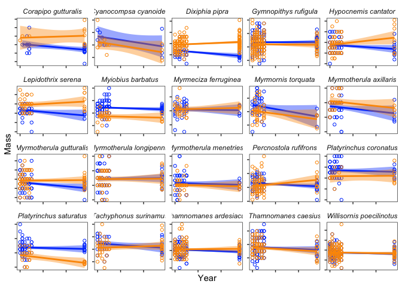
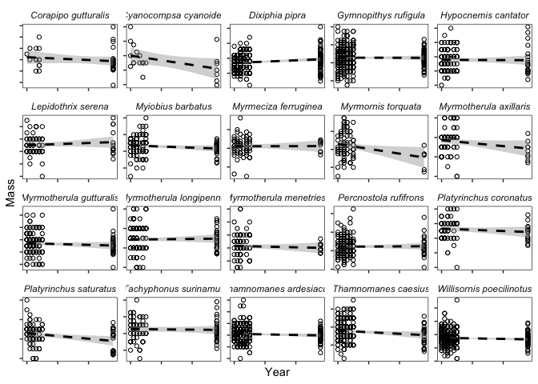
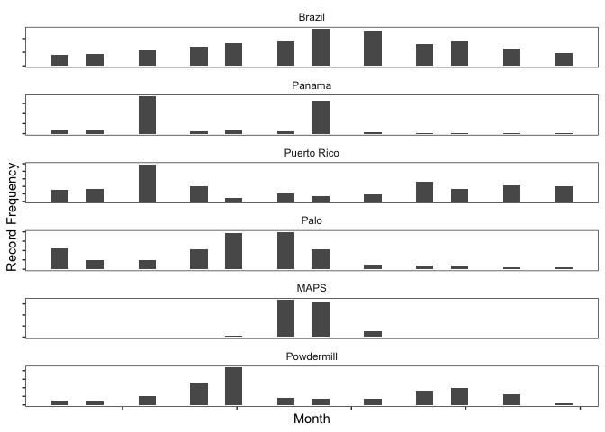

Bird body size change analysis
================

## Data cleaning

To start, we’re going to transform the phase IV data from our five sites
(in Brazil, Panama, Puerto Rico, CA, PA, and WY) into a useable form,
and then apply a series of filters. The full code for this step is in
`data_cleaning.R`; I’ll walk through the treatment for Brazil alone to
demonstrate the process without repetition.

We begin by loading the .csv file, which I’ve duplicated and renamed,
and subsetting it to the columns of interest (as in Xingli’s code):

``` r
# load brazil data
brazil.full <- read.csv("~/Dropbox/Bird_body_size-analysis/bird_body_size/data/brazil_raw.csv") 

# subset to relevant columns
brazil.df <- brazil.full[,c("Updated.Scientific.Name","Month","Year","Band.Number","Sex","Age","Mass")]
```

Let’s get an idea of how much data and how many species we have:

``` r
# count number of records
n.data.original <- nrow(brazil.df)
print(n.data.original)
```

    ## [1] 24104

``` r
# count number of species
n.species.original <- length(unique(brazil.df$Updated.Scientific.Name)) 
print(n.species.original)
```

    ## [1] 143

Next, we’re going to apply a series of filters. At this stage in the
project, I’m going to keep data from all months—both to see what the
trends are with as much power as possible, and because comparing the
frequency of records throughout the year for our different sites might
inform which season(s) we end up including for the final analysis. But
we do want to make sure we’re only using data from adult birds, data
with mass values (in g), and data from birds that were sexed. We also
want to use only the data from the first capture for birds that came
into nets more than once, which we’ll do by ordering the data frame by
year and month and then dropping duplicate band numbers after their
first occurrence.

``` r
# subset to only known sex
brazil.df <- brazil.df[brazil.df$Sex %in% c("F","M"),] 

# subset to adults only
brazil.df <- brazil.df[brazil.df$Age %in% "AD",] 

# subset to only records with mass data
brazil.df <- brazil.df[!is.na(brazil.df$Mass),]

# order by month and year
brazil.df <- brazil.df[order(brazil.df$Year, brazil.df$Month),]

# drop duplicates
brazil.df <- brazil.df[!duplicated(brazil.df$Band.Number),]
```

Let’s rename the columns of the data frame, strictly as a matter of my
own preference for naming format. And because treating species as a
factor causes problems down the line, we’ll ensure the species column is
character class.

``` r
# rename columns
colnames(brazil.df) <- c("species","month","year","band_no","sex","age","mass")

# make sure all species are represented by changing to character
brazil.df$species <- as.character(brazil.df$species)
```

Next, we need to group records by time period, ensuring we have enough
data for each species in both the past and present, for the purpose of
meaningful comparisons. Brazil is an outlier among out datasets in only
having a single modern sampling year, so we’ll use a cutoff of 2000 to
separate it, but for the other datasets we’ll simply take the median
(e.g. `median(panama.df$year))`. We’ll use the `ifelse()` function to
assign all records prior to this date as “old”, and the remainder as
“new”:

``` r
# create binary code for sampling period
brazil.df$period <- ifelse(brazil.df$year < 2000, "old", "new")
```

For the next series of steps we’ll break the data frame into smaller
data frames to ensure we have an appropriate number of samples for each
sex and time period. First, we’ll figure out which species have at least
five species per time period, and save this information as two vectors:

``` r
# create mini data frames by period for filtering
brazil.old <- brazil.df[brazil.df$period=="old",]
brazil.new <- brazil.df[brazil.df$period=="new",]

# drop old species without five individuals per time period
brazil.old.species <- as.data.frame(table(brazil.old$species))
colnames(brazil.old.species) <- c("species", "frequency")
brazil.sp.old.keep <- brazil.old.species[which(brazil.old.species$frequency > 4),]
brazil.sp.old.keep <- as.character(brazil.sp.old.keep$species)

# drop new species without five individuals per time period
brazil.new.species <- as.data.frame(table(brazil.new$species))
colnames(brazil.new.species) <- c("species", "frequency")
brazil.sp.new.keep <- brazil.new.species[which(brazil.new.species$frequency > 4),]
brazil.sp.new.keep <- as.character(brazil.sp.new.keep$species)
```

Next, we’ll figure out which species have at least three individuals per
sex per time period, and save this as a pair of vectors as well:

``` r
# create mini data frames by sex for filtering
brazil.old.m <- brazil.old[brazil.old$sex=="M",]
brazil.old.f <- brazil.old[brazil.old$sex=="F",]
brazil.new.m <- brazil.new[brazil.new$sex=="M",]
brazil.new.f <- brazil.new[brazil.new$sex=="F",]

# drop species without 3 male individuals per sex per time period
brazil.old.m.species <- as.data.frame(table(brazil.old.m$species))
colnames(brazil.old.m.species) <- c("species", "frequency")
brazil.sp.old.m.keep <- brazil.old.m.species[which(brazil.old.m.species$frequency > 2),]
brazil.sp.old.m.keep <- as.character(brazil.sp.old.m.keep$species)
brazil.new.m.species <- as.data.frame(table(brazil.new.m$species))
colnames(brazil.new.m.species) <- c("species", "frequency")
brazil.sp.new.m.keep <- brazil.new.m.species[which(brazil.new.m.species$frequency > 2),]
brazil.sp.new.m.keep <- as.character(brazil.sp.new.m.keep$species)

# drop species without 3 female individuals per sex per time period
brazil.old.f.species <- as.data.frame(table(brazil.old.f$species))
colnames(brazil.old.f.species) <- c("species", "frequency")
brazil.sp.old.f.keep <- brazil.old.f.species[which(brazil.old.f.species$frequency > 2),]
brazil.sp.old.f.keep <- as.character(brazil.sp.old.f.keep$species)
brazil.new.f.species <- as.data.frame(table(brazil.new.f$species))
colnames(brazil.new.f.species) <- c("species", "frequency")
brazil.sp.new.f.keep <- brazil.new.f.species[which(brazil.new.f.species$frequency > 2),]
brazil.sp.new.f.keep <- as.character(brazil.sp.new.f.keep$species)
```

Lastly, we figure out which species are shared among all these vectors,
i.e. the species that meet all our cutoffs, and subset the data frame to
drop all others:

``` r
# find overlapping set
brazil.sp.sex.keep <- intersect(brazil.sp.new.f.keep, brazil.sp.new.m.keep) 
brazil.sp.time.keep <- intersect(brazil.sp.old.f.keep, brazil.sp.old.m.keep)
brazil.sp.keep <- intersect(brazil.sp.sex.keep, brazil.sp.time.keep)

# subset major data frame
brazil.df <- brazil.df[which(brazil.df$species %in% brazil.sp.keep),]
```

The final step in our filtering is to drop all records that seem to have
obviously erroneous mass data. We’ll exclude any data point that is
greater or lower than two standard deviations from the mean:

``` r
# drop mass outliers (> 2 sd)
brazil.df <- brazil.df[abs(brazil.df$mass-mean(brazil.df$mass))< 2*sd(brazil.df$mass),]
```

How much did we end up filtering?

``` r
# count number of records
n.data.filtered <- nrow(brazil.df)
print(n.data.filtered)
```

    ## [1] 3706

``` r
# count number of species
n.species.filtered <- length(unique(brazil.df$species)) 
print(n.species.filtered)
```

    ## [1] 20

``` r
# how many records  lost?
print(n.data.original-n.data.filtered)
```

    ## [1] 20398

``` r
# how many species lost?
print(n.species.original-n.species.filtered)
```

    ## [1] 123

Quite a bit, but still solid data for 20 species. Could be worse\! Let’s
write the data frame to a new .csv file we can use for plotting:

``` r
# write filtered data frame
write.csv(brazil.df, file="~/Dropbox/Bird_body_size-analysis/bird_body_size/data/brazil_filtered.csv")
```

The process is essentially the same for the other sites, with a few
exceptions. First, we lack good sex data for most Puerto Rican brids, so
we don’t apply and sex-related filters (and only plot overall trends).
Second, idiosyncrasies in the format of each dataset means there are
additional lines of code to ensure the proper columns are characters
versus factors, etc. (Again, these steps are all commented in
`scripts/data_cleaning.R`)

## Plotting

Let’s visualize our results from Brazil, and look at the frequency of
records by month across sites to start thinking about how we want to
apply temporal filters. We’ll use ggplot2, which we need to load. To
avoid messing with the original data frame, we’ll import the .csv file
we wrote during filtering directly as a new object:

``` r
# load ggplot
library(ggplot2)

# load brazil data
brazil.plotting <- read.csv(file = "~/Dropbox/Bird_body_size-analysis/bird_body_size/data/brazil_filtered.csv")[-1]
```

We’ll use faceting to plot each species in its own grid cell, rather
than repeating code for each species independently. First, we’ll
separate males and females, and overlay a linear model on each
independently:

<!-- -->

Next, we’ll lump males and females, and just look at the overall trend:

<!-- -->

I’ll avoid making pronouncements without statistics, but there are
definitely declines\! I’ve written these plots in a more readable format
as .pdf files (available for each site in `plots/`).

Next, let’s look at the distribution of records across months and sites.
We’ll need all the filtered datasets, which we can import directly:

``` r
brazil.df <- read.csv(file = "~/Dropbox/Bird_body_size-analysis/bird_body_size/data/brazil_filtered.csv")[-1]

panama.df <- read.csv(file = "~/Dropbox/Bird_body_size-analysis/bird_body_size/data/panama_filtered.csv")[-1]

puertorico.df <- read.csv(file = "~/Dropbox/Bird_body_size-analysis/bird_body_size/data/puertorico_filtered.csv")[-1]

palo.df <- read.csv(file = "~/Dropbox/Bird_body_size-analysis/bird_body_size/data/palo_filtered.csv")[-1]

maps.df <- read.csv(file = "~/Dropbox/Bird_body_size-analysis/bird_body_size/data/maps_filtered.csv")[-1]

powdermill.df <- read.csv(file = "~/Dropbox/Bird_body_size-analysis/bird_body_size/data/powdermill_filtered.csv")[-1] 
```

We’ll then do some tedious manipulation to get a tidyverse friendly
dataframe for facetting, where each month record is paired with the site
it belongs to:

``` r
## make months df
brazil.mo <- as.data.frame(brazil.df[,c("month")])
brazil.mo$country <- rep("brazil", nrow(brazil.mo))
colnames(brazil.mo) <- c("month","country")
panama.mo <- as.data.frame(panama.df[,c("month")])
panama.mo$country <- rep("panama", nrow(panama.mo))
colnames(panama.mo) <- c("month","country")
puertorico.mo <- as.data.frame(puertorico.df[,c("month")])
puertorico.mo$country <- rep("puertorico", nrow(puertorico.mo))
colnames(puertorico.mo) <- c("month","country")
palo.mo <- as.data.frame(palo.df[,c("month")])
palo.mo$country <- rep("palo", nrow(palo.mo))
colnames(palo.mo) <- c("month","country")
maps.mo <- as.data.frame(maps.df[,c("month")])
maps.mo$country <- rep("maps", nrow(maps.mo))
colnames(maps.mo) <- c("month","country")
powdermill.mo <- as.data.frame(powdermill.df[,c("month")])
powdermill.mo$country <- rep("powdermill", nrow(powdermill.mo))
colnames(powdermill.mo) <- c("month","country")
months.df <- rbind(brazil.mo,panama.mo,puertorico.mo,palo.mo,maps.mo,powdermill.mo)
```

(We’ll write this as a .csv as well for future use:)

``` r
# write months df
write.csv(months.df, file="~/Dropbox/Bird_body_size-analysis/bird_body_size/data/months.csv")
```

So how much does our quantity of data vary across sites? Here’s a
histogram to visualize that:

<!-- -->

Answer: a bit\! We can talk more about this in meeting.
